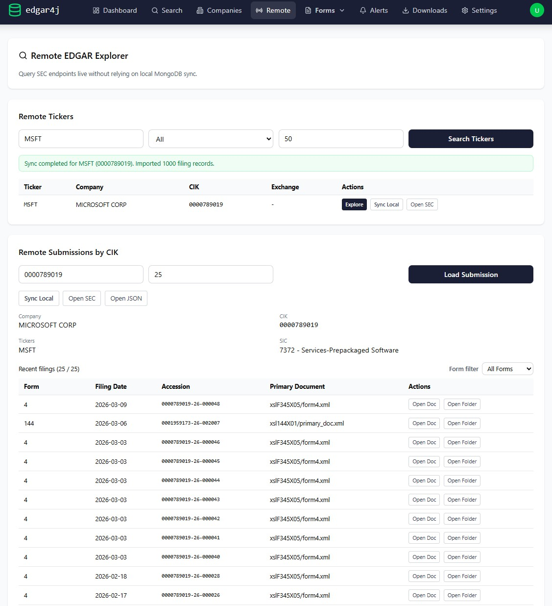
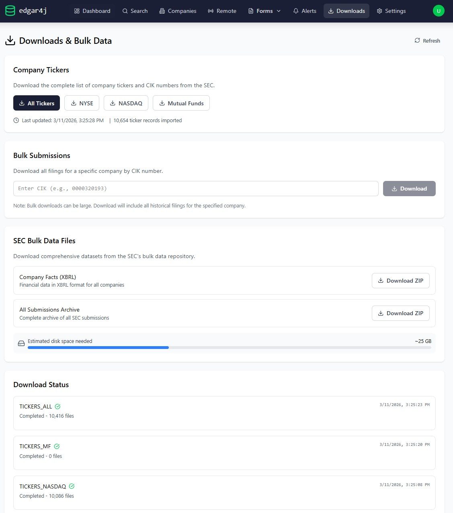
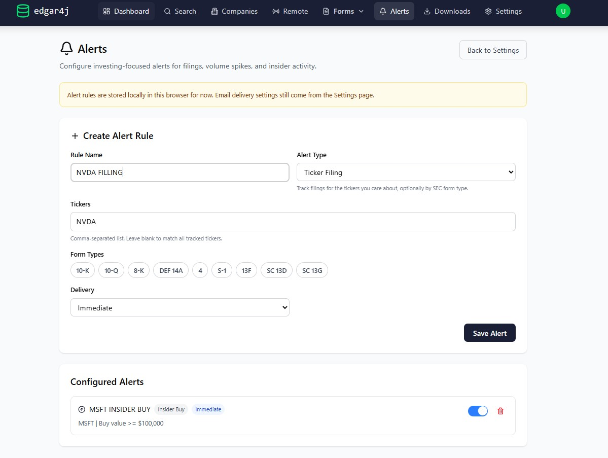
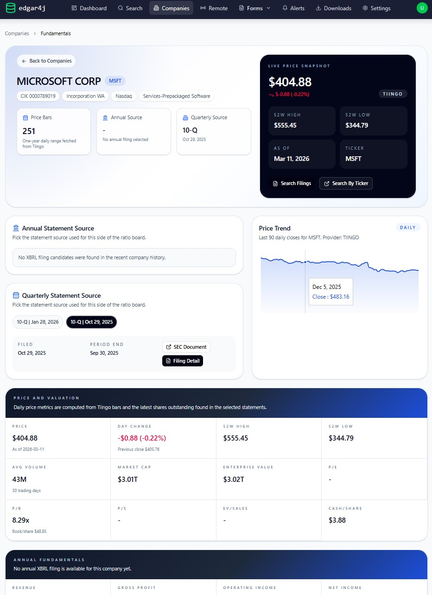
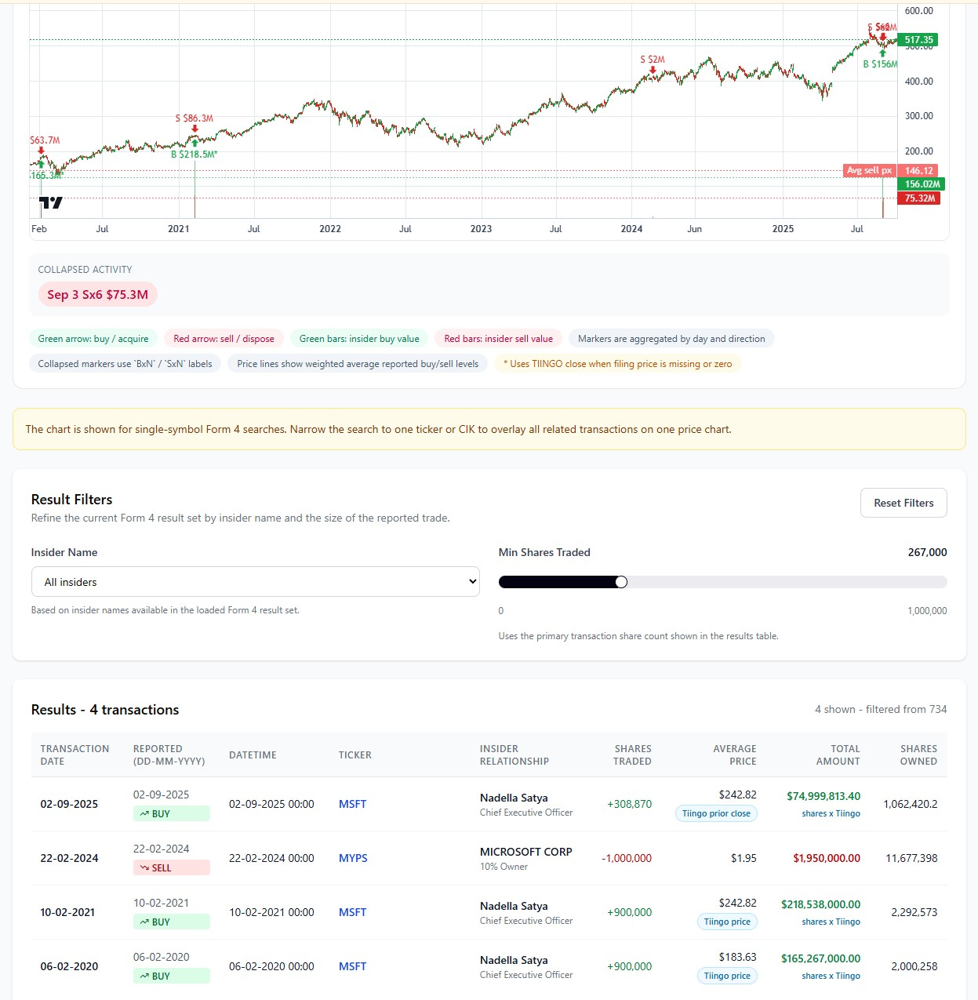
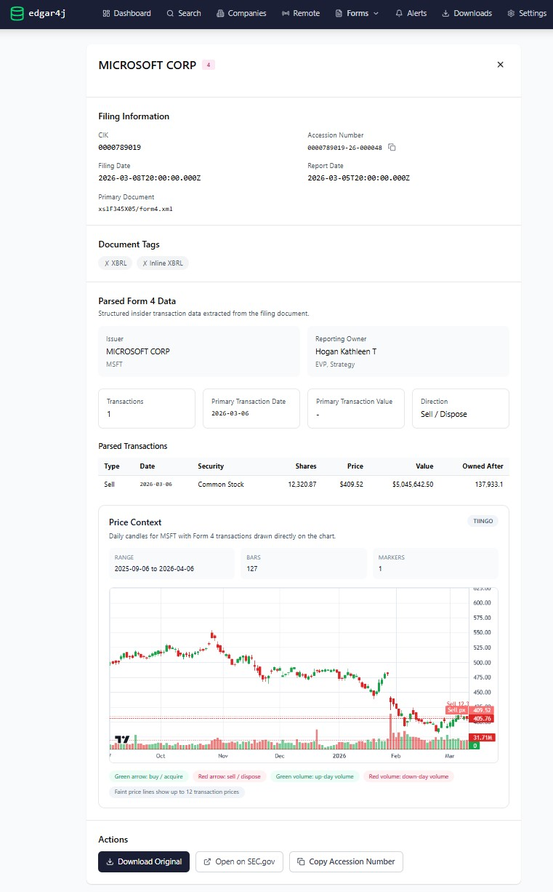
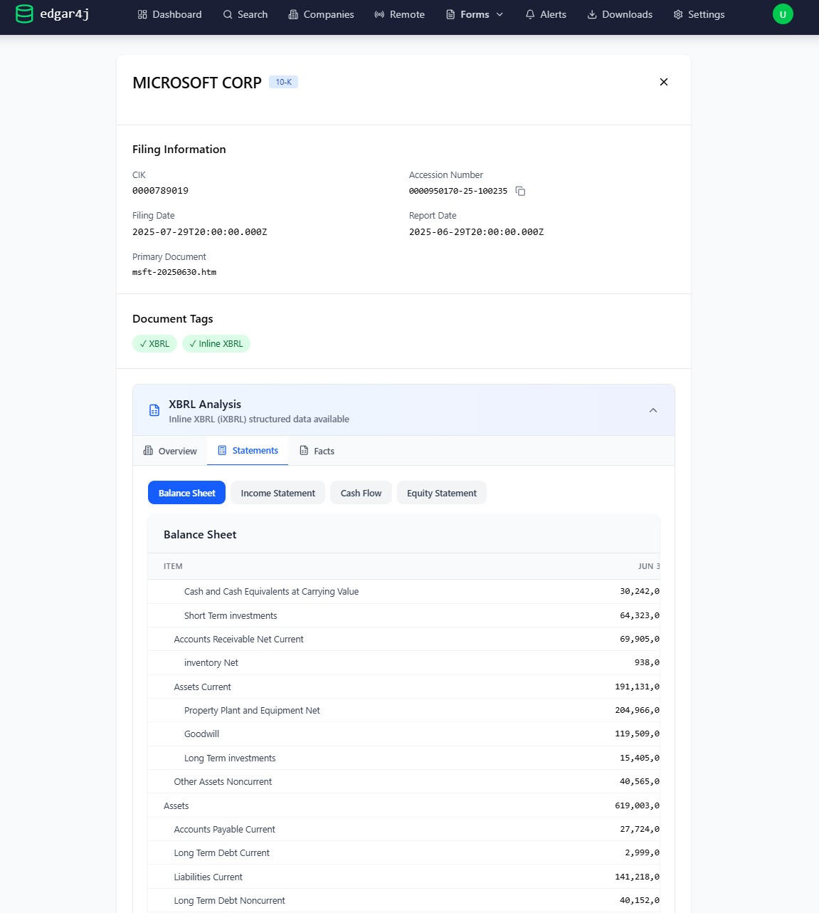

# Introduction to Edgar4J

The goal of this library is to provide a framework for collecting and organizing fillings from the SEC website.

The scope will initially be confined to stock ownership and insider transactions.

Based on: https://www.sec.gov/edgar/sec-api-documentation

## Configuration

Most settings are configured via environment variables (with sane defaults for local development). Key options:

### SEC access

- `SEC_USER_AGENT`: User-Agent sent to `sec.gov` / `data.sec.gov`. Use a real identifier plus a monitored contact email such as `Your Company Name sec-ops@your-company.com`. Do not use `example.com` or noreply addresses.
- `edgar4j.sec.rate-limit-per-second` (env: `EDGAR4J_SEC_RATE_LIMIT_PER_SECOND` if you map it yourself): Max requests/sec enforced by the internal rate limiter (default `10`).

### Storage (daily index downloads)

- `EDGAR4J_DAILY_INDEXES_PATH`: Directory for downloaded daily master index files (default `./data/daily-indexes`).

### Ticker Data Sources

- SEC company tickers are sourced from the SEC ticker datasets exposed by `https://www.sec.gov/files/company_tickers.json` and the related download flows in the app.
- Filing price charts can use Tiingo daily market data when Tiingo is configured in Settings or when a repo-root `tiingo.env` file is present.

If `tiingo.env` exists in the repository root, the backend will automatically use it as a fallback credential source for ticker chart data:

- `TIINGO_API_TOKEN`: Tiingo API token used for on-demand daily candle downloads.
- `TIINGO_API_BASE_URL`: Optional Tiingo API base URL override.
- `TIINGO_URL`: Compatibility alias for the Tiingo base URL. If you point it at `https://api.tiingo.com/api/test`, edgar4j normalizes that back to `https://api.tiingo.com` for actual market-data requests.
- `TIINGO_DATA_DIR`: Base directory for the local Tiingo cache. The app stores chart data under `TIINGO_DATA_DIR/edgar4j/prices_1d`.

Notes:

- This fallback is used even when the Settings page does not contain a saved Tiingo API key.
- The Settings API intentionally does not echo the token back to the frontend, so the UI can show Tiingo as configured while the API key field remains blank.
- When the first filing chart is opened for a ticker/date range, the backend downloads the required candles and caches them locally for reuse.

### MongoDB

- `SPRING_MONGODB_URI` or `MONGO_URL`: Mongo connection string (default `mongodb://localhost:27017/edgar`).
- `MONGODB_AUTO_INDEX_CREATION`: Enables Spring Data Mongo index creation on startup (default `true`).

### Spring Cloud Config (optional)

- `SPRING_CLOUD_CONFIG_ENABLED`: Enables Spring Cloud Config client (default `false`).

### Security (optional, recommended for production)

By default, the app permits all requests (good for local dev). To protect `/api/**` and `/actuator/**` with HTTP Basic:

- `EDGAR4J_SECURITY_ENABLED=true`
- `EDGAR4J_SECURITY_USERNAME=...`
- `EDGAR4J_SECURITY_PASSWORD=...`

When enabled, `/actuator/health` and `/actuator/info` remain public, everything under `/api/**` and other actuator endpoints requires auth.

### Actuator

- `MANAGEMENT_HEALTH_SHOW_DETAILS`: Controls health endpoint details (default `never`).

### Elasticsearch (optional)

Elasticsearch repositories are disabled by default. To enable them, run with the `elasticsearch` Spring profile and provide endpoints/credentials:

- Profile: `elasticsearch`
- `ELASTICSEARCH_ENDPOINTS` (default `localhost:9200`)
- `ELASTICSEARCH_USERNAME` (default `elastic`)
- `ELASTICSEARCH_PASSWORD` (default `changeme`)

### Jobs

- `TICKER_SYNC_ENABLED` (default `true`)
- `FILING_SYNC_ENABLED` (default `true`)
- `DATA_INTEGRITY_ENABLED` (default `true`)

## Build

This repo uses the Maven Wrapper. On Windows, `mvnw.cmd` will fall back to the `java` found on `PATH` if `JAVA_HOME` is not set correctly.

Backend builds now target Java 25. Set `JAVA_HOME` to a JDK 25 installation, or use the checked-in `.java-version` file with your version manager.

### Compile and Start with Docker

Prerequisites:

- Docker Desktop (or Docker Engine) with Docker Compose v2

From the repository root:

1. Build the backend image (this compiles the Java project inside Docker):

```bash
docker build -t edgar4j-app-clean .
```

2. Start the full stack:

```bash
docker compose up -d
```

3. Verify containers are up:

```bash
docker compose ps
```

4. Open the application:

- Frontend: `http://localhost:5173`
- Backend API: `http://localhost:8080`
- Health check: `http://localhost:8080/actuator/health`
- Readiness check: `http://localhost:8080/actuator/health/readiness`
- Liveness check: `http://localhost:8080/actuator/health/liveness`

Useful Docker commands:

```bash
# Follow backend logs
docker compose logs -f edgar4j-app

# Follow frontend logs
docker compose logs -f frontend

# Rebuild backend after backend code changes
docker build -t edgar4j-app-clean . && docker compose up -d --force-recreate edgar4j-app

# Stop everything
docker compose down

# Stop and remove volumes (destructive)
docker compose down -v
```

## Staging Readiness

Use [docs/staging-smoke-checklist.md](docs/staging-smoke-checklist.md) as the final pre-release and post-deploy smoke test guide.

For targeted enrichment when insider rows are present but market-cap data is still sparse, use [docs/market-cap-backfill.md](docs/market-cap-backfill.md).

## Submissions API

Each entity's current filing history is available at the following URL:

https://data.sec.gov/submissions/CIK##########.json
Where the ########## is the entity’s 10-digit Central Index Key (CIK), including leading zeros.

Example for Microsoft: https://data.sec.gov/submissions/CIK0000789019.json

### Get a Document

From the Submissions file above: https://data.sec.gov/submissions/CIK{CIK}.json

We can get each document by using the following End Point:

https://www.sec.gov/Archives/edgar/data/{CIK}/{AccessionNumber}/{PrimaryDocument}

Example from Microsoft: https://www.sec.gov/Archives/edgar/data/789019/000162643116000118/xslF345X03/edgar.xml

**Note**: Remove '-' from the Accession Number.

## Bulk

## Application Screenshots

### Remote EDGAR Explorer



### Downloads and Bulk Data



### Alerts



### Company Fundamentals



## Forms

### Ownership: 13D/13G and 13F

https://www.sec.gov/dera/data/form-13f

Schedule 13D and 13G are used to report a party's ownership of stock which exceeds 5% of a company's total stock issue.
Schedule 13D is for active/intent-to-influence ownership, while Schedule 13G is for passive ownership.

Form 13F is a quarterly report that is required to be filed by all institutional investment managers with at least $100 million in assets under management.

### Insider Transactions: 3, 4 and 5

**SEC Form 4**: Statement of Changes in Beneficial Ownership? SEC Form 4: Statement of Changes in Beneficial Ownership is a document that must be filed with the Securities and Exchange Commission (SEC) whenever there is a material change in the holdings of company insiders.





**SEC Form 3**: Is a document that a company insider or major shareholder must file with the SEC. The information provided on the form is meant to disclose the holdings of directors, officers, and beneficial owners of registered companies and becomes public record.

**SEC Form 5**: Annual Statement of Changes in Beneficial Ownership of Securities is a document that company insiders must file with the Securities and Exchange Commission (SEC) if they have conducted transactions in the company's securities during the year.

### Current Reports: 6-K and 8-K

**SEC Form 6-K**: Report of foreign private issuers on major events or updates between annual reports.

**SEC Form 8-K**: Current report used to announce major events that shareholders should know about.

### Annual Reports: 10-K, 10-Q and 20-F

**SEC Form 10-K**: Annual report that provides a comprehensive summary of a company's business and financial condition.



**SEC Form 10-Q**: Quarterly report with unaudited financial statements and updates on business performance between annual reports.

**SEC Form 20-F**: Annual report for foreign private issuers with comprehensive company and financial information.

## Terms

**Accession Number**: Unique for each filling
